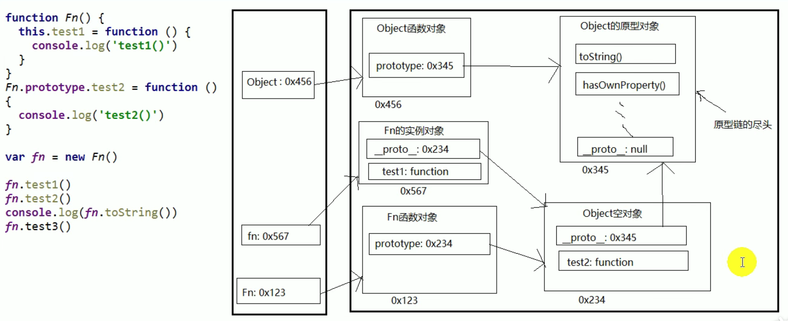

# Basic

> `JavaScript`代码是按照从上到下的顺序，逐行执行的。

```javascript
// 浏览器弹框
alert('Hello World')
// 在浏览器页面输出一个内容
document.write('Hello World')
// 向浏览器控制台输出一个内容
console.log('Hello World')
```

## JS代码编写位置

- 写在`HTML`标签中：
  - 写在标签的属性中属于结构与行为耦合，不方便维护，所以不推荐使用。
  - 可以将`JavaScript`代码写在`script`标签中。
  - 可以将`JavaScript`代码编写到外部`.js`文件中，然后通过`script src`引入文件。
  - 写在外部文件中可以在不同的页面中同时引用，也可以利用浏览器的缓存机制。推荐使用！

```html
<!-- 可以将JS代码编写到按钮标签的onclick中，点击按钮时JS代码才会执行 -->
<button onclick="alert('点击成功')">点击一下</button>
<!-- 可以将JS代码写在超链接的href属性中，点击超链接时JS代码才会执行-->
<a href="javascript:alert('点击成功');">点击一下</a>

<script>
  alert('Hello World')
</script>

<!-- script标签一旦用于外部文件，就不能再内部编写代码，浏览器会自动忽略 -->
<script src="./index.js">
  alert('内部的Hello World.')
</script>
```

## JS基本语法

### 注释

- 注释中的内容不会被执行，但是可以在源代码中查看，也可以通过注释来对代码进行一些简单的调试

```javascript
// 单行注释

/*
 多
 行
 注
 释
*/
```

### 基本语法

- `JavaScript`中严格区分大小写
- `JavaScript`中每条语句以`;`分号结尾，如果不写分号浏览器会自动添加，但是会消耗一定的系统资源
  - `;[]、;()、;{}`格式
- `JavaScript`中会自动忽略多个空格和换行，所以可以利用空格和换行对代码进行格式化

### 字面量

> 字面量是一些不可改变的值，如：
>
> - 数字（`1、2、3、4...`）
> - 字符串（`'str'、'123'、'man'...`）
> - `...`

- 字面量都是可以直接使用的，但是一般都不会直接使用字面量

### 变量

> 变量可以用来保存字面量，而且变量的值是可以任意改变的，所有变量更加方便使用
> 所以开发中都是用变量来保存一个字面量，而不会直接使用字面量

- 声明变量

> 在`JS`中使用`var`关键字来声明一个变量

```javascript
var a
a = 123
a = 456
var b = 'str'
```

### 标识符

> 在`JS`中所有由我们自主命名的都可以称为是标识符
> `JS`底层保存标识符时实际上是采用`Unicode`编码，理论上讲所有`utf-8`中含有的内容都可以作为标识符
> 如：变量名、函数名、属性名...都属于标识符
> 命名一个标识符时需要遵守如下的规则

- 标识符中可以含有字母、数字、_、$
- 标识符不能以数字开头
- 标识符不能是`ES`中的关键字和保留字
- 标识符一般都采用驼峰命名法

### 数据类型

> 数据类型指的是字面量的类型
> 在`JS`中一共有六种数据类型：
>
> - `5`种基本数据类型
> - `1`种引用数据类型

#### 基本数据类型

> 值类型

- `String`：字符串类型
  - 需要使用单引号`' '`或双引号`" "`引号引起来
  - 单引号`' '`和双引号`" "`不能混着
  - 同种引号不能嵌套
  - 在字符串中可以使用反斜杠`\`作为转义字符，当使用一些特殊符号时可以使用`\`进行转义
- `Number`：数字类型
  - 包括整数和浮点数
  - 可以使用`typeof`来检查变量的类型：`typeof x`，会返回数据类型
  - `JS`中数字的最大值：`Number.MAX_VALUE`，如果使用`Number`表示的数字超过了最大值，则会返回一个`Infinity`，表示正无穷，`-Infinity`表示负无穷
  - `JS`中数字的最小值：`Number.MIN_VALUE`，大于`0`的最小值
  - `NaN`是一个特殊的数字，表示`Not a Number`
  - 在`JS`中整数的运算基本可以保证精确，如果使用`JS`进行浮点数运算，可能得到一个不精准的结果
  - 所以千万不要使用`JS`进行对精确度要求比较高的运算
- `Boolean`：布尔值
  - 布尔值只有两个：`true`和`false`，主要用来做逻辑判断
- `Null`：空
  - `Null`类型值只有一个：`null`，专门用来表示一个为空的对象
  - 使用`typeof`检查一个`null`值时，会返回一个`Object`
- `Undefined`：未定义
  - `Undefined`类型的值只有一个：`undefined`
  - 当声明一个变量但不给这个变量赋值时，它的值就是`undefined`
  - 使用`typeof`检查一个`undefined`时也会返回一个`undefined`

##### undefined和null的区别

- `undefined`：表示定义了但未赋值
- `null`：表示定义了并赋值，只是值为`null`
  - 初始赋值为`null`，表示将要赋值为对象
  - 结束赋值为`null`，让对象成为垃圾对象，被垃圾回收器回收

```javascript
// 初始赋值为null，表示将要赋值为对象
var b = null
// 确定对象就赋值
b = ['abc', 12]
// 最后让b指向的对象成为垃圾对象（被垃圾回收器回收）
b = null
```

#### 引用数据类型

> 对象（引用）类型

- `Object`：任意对象
- `Function`：一种特别的对象 => 可以执行
- `Array`：一种特别的对象 => 数值下标，内部数据是有序的

#### 类型判断方式

- `typeof`：返回的是数据类型的字符串表达
  - 可以判断：`undefined`、数值、字符串、布尔值
  - 不能判断`null`、`object`和`array`

```javascript
var a
console.log(a, typeof a, typeof a === 'undefined', a === undefined) // undefined 'undefined' true true
```

- `instanceof`：判断对象的具体类型

```javascript
var b1 = {
  b2: [1, 'abc', console.log],
  b3: function() {
    console.log('b3')
  }
}

// instanceof 实例，b1 是否为 Object 的实例
console.log(b1 instanceof Object) // true

console.log(typeof b1.b3 === 'function') // true

```

- `===`
  - 可以判断`undefined`

#### 严格区分变量类型和数据类型

- 数据的类型
  - 基本类型
  - 对象类型
- 变量的类型：变量内存值的类型
  - 基本类型：保存的是基本类型的数据
  - 引用类型：保存的是地址值

```javascript
var a = {}
```

#### 什么是数据

> 存储在内存中代表特定信息的东西，本质上0101...（二进制数据）

- 数据的特点
  - 可传递
  - 可运算
- 一切皆数据
- 内存中所有操作的目标：数据
  - 算术运算
  - 逻辑运算
  - 赋值运算
  - 运行函数

```javascript
var a = 1
```

#### 什么是内存

> 内存条通电后产生的可存储数据的空间（临时的）

- 内存的产生和死亡：
  - 内存条（电路板）=> 通电 => 产生内存空间 => 存储数据 => 处理数据 => 断电 => 内存空间和数据都消失
- 一块内存的`2`个数据
  - 内部存储的数据
  - 地址值
- 内存的分类
  - 栈内存：变量地址（标识）
  - 堆内存：对象数据

```javascript
var obj = { name: 'Tom' }

console.log(obj.name)
```

#### 什么是变量

> 可变化的量，由变量名和变量值组成，每个变量都对应一块小内存空间

- 变量名用来查找对应的内存
- 变量值就是内存中保存的数据

#### 内存、数据和变量之间的关系

- 内存是用来存储数据的空间
- 变量是内存的标识

```javascript
// var a = xxx, a内存中保存的是什么
// xxx 是基本数据，a保存的就是这个数据
// xxx 是对象，a保存的就是这个对象的引用地址值
// xxx 是一个变量，a保存的是xxx的内存内容：基本数据/地址值

var obj1 = { name: 'Tom'm, age: 18 }
var obj2 = obj1
obj1.age = 20
console.log(obj2.age) // 20
obj2.name = 'Jack'
console.log(obj1.name) // Jack

function fn1(obj) {
  obj.name = 'Jun'
}
fn1(obj1)
console.log(obj2.name) // Jun

// 将 obj2 的引用地址赋值给obj
function fn2(obj) {
  // obj 改变指向
  obj = { name: 'May', age: 30 }
}
fn2(obj2)
// obj2 不变
console.log(obj2) // { name: Jun, age: 20 }
```

- 在`JS`调用函数时传递变量参数时，是值传递还是引用传递
  - 都是值传递：基本值或引用值（`{ name: 'Tom' }`）
  - 可能是值传递，也可能是引用传递（地址值：`0x123`）

```javascript
var a = 3
function fn1(a) { // 也可以理解为此时传递的a就是3
  // 在函数体中定义了局部变量 var a
  a = a + 1
}
fn1(a)
console.log(a) // 3

function fn2(obj) {
  console.log(obj.name)
}
var obj = { name: 'Tom' }
fn2(obj) // Tom

```

#### JS引擎如何管理内存

- 内存生命周期
  - 分配内存空间，得到它的使用权
  - 存储数据，可以进行操作
  - 释放内存空间
- 释放内存
  - 局部变量：函数执行完自动释放
  - 对象：成为垃圾对象`null` => 垃圾回收器回收

```javascript
function fn() {
  var b = {}
}

fn() // b 是自动释放，b 所指向的对象是在后面的某个时刻由垃圾回收器回收
```

### 类型转换

> 将一个数据类型转换为其他的数据类型
> 主要是将其他的数据类型转换为`String、Number、Boolean`

#### 转换为String类型

- 调用被转换数据类型的`toString()`方法
  - 此方法不会影响原数据的数据类型
  - 注意：`null`和`undefined`没有`toString()`方法，调用会报错
- 调用`String()`函数并将要转换的数据作为参数传递给此函数
  - 此方法不会影响原数据的数据类型
  - 注意：对于`Number`和`Boolean`数据类型转换方式与`toString()`方法一致
  - 对于`null`和`undefined`会直接转换为`"null"`和`"undefined"`，不会报错

```javascript
var a = 123

a.toString()

String(a)
```

#### 转换为Number类型

- 调用`Number()`函数并将要转换的数据作为参数传递给此函数
  - 此方法不会影响原数据的数据类型
  - 如果是纯数字的字符串，直接将其转换为数字，否则则转换为`NaN`
  - 如果是空串或者全是空格的字符串，则转换为`0`
  - 如果是布尔`Boolean`类型转为数字类型，`Number(true) => 1`，`Number(false) => 0`
  - `null`类型转为数字类型：`Number(null) => 0`
  - `undefined`类型转为数字类型：`Number(undefined) => NaN`
- `parseInt()`函数：把一个字符串转换为整数
  - `parseInt()`可以将一个字符串中有效的整数内容取出来，转换为`Number`
  - `parseInt('123px') => 123`
- `parseFloat()`函数：把一个字符串转换为浮点数
  - `parseFloat()`可以将一个字符串中有效的整数和小数内容取出来，转换为`Number`
- `parseInt()`和`parseFloat()`对非`String`类型的数据进行转换时，会先将其转换为`String`类型，再进行类型转换
- 其他进制的数字
  - 在`JS`中表示`16`进制的数字需要以`0x`开头：`0x10`
  - 在`JS`中表示`8`进制的数字需要以`0`开头：`070`
  - 在`JS`中表示`2`进制的数字需要以`0b`开头，但不是所有的浏览器都支持：`0b10`
  - 像`"070"`这种字符串，有些浏览器会当成`10`进制的解析，而有些浏览器会当成`8`进制解析
  - 可以在`parseInt('070', 10)`中传递第二个参数来指定数字的进制

```javascript
var a = '123'

Number(a)

parseInt(a)

parseFloat(a)
```

#### 转换为Boolean类型

- 调用`Boolean()`函数并将要转换的数据作为参数传递给此函数
  - `Number`转`Boolean`：除了`0`和`NaN`，其余都是`true`
  - `String`转`Boolean`：除了空字符串，其余都是`true`
  - `null/undefined`转`Boolean`：都是`false`
  - `Object`转`Boolean`：都是`true`

## 对象

### 什么是对象

> 多个数据的封装体，用来保存多个数据的容器
> 一个对象代表现实中的一个事物

### 为什么要用对象

> 统一管理多个数据

### 对象的组成

- 属性：由属性名和属性值组成
  - 属性名本质上是字符串
  - 属性值有任意类型组成
- 方法：一种特别的属性
  - 属性值是函数

### 如何访问对象内部的数据

- 通过`obj.属性名`来访问
  - 编码简单，但有时不能用
  - 属性名包含特殊字符：`-/空格`时
  - 变量名不确定
- 通过`obj['属性名']`来访问
  - 编码麻烦，能通用

```javascript
var person = {
  name: 'Tom',
  age: 18,
  say: function() {
    console.log('Hello')
  },
  setName: function(name) {
    this.name = name
  },
  setAge: function(age) {
    this.age = age
  }
}

console.log(person.name, person.setName, person['age'], person['setAge'])

// 不能用 obj.属性名的情况
// 1. 属性名包含特殊字符
person.say-hi = 'Hi' // 报错
person['say-hi'] = 'Hi'
console.log(person['say-hi'])

// 2. 变量名不确定
var study = 'math'
var score = 90
person.study = score
person[study] = score
console.log(person[study])
```

## 函数

### 概念

#### 什么是函数

> 实现特定功能的`n`条语句的封装体
> 只有函数是可以执行的，其他类型的数据不能执行

#### 为什么要用函数

- 提高代码复用
- 便于阅读交流

#### 如何定义函数

- 函数声明：`function fn(){ ... }`
- 表达式：`var fn =  function(){ ... }`
- 构造函数：`new Function('fn', '...')`

```javascript
// 函数声明
function fn1() {
  console.log('fn1')
}

// 表达式
var fn2 = function() {
  console.log('fn2')
}

// 构造函数
new Function('fn3', 'console.log(fn3)')
```

#### 如何调用函数

- `fn()`：直接调用
- `obj.fn()`：通过对象调用
- `new fn()`：通过`new`调用
- `fn.call(obj) || fn.apply(obj)`：相当于`obj.fn()`，临时让`fn()`函数成为`obj`的方法进行调用

```javascript
var obj = { name: 'Tom' }
function fn() {
  this.name = name
}

// obj.fn() 不能直接调用，obj中没有 fn 方法
fn.call(obj) // 可以让一个函数成为指定任意对象的方法进行调用
console.log(obj.name)
```

### 回调函数

#### 什么函数是回调函数

- 你定义的
- 你没有调用
- 但最终它执行了

```javascript
// DOM 事件回调函数
document.getElementById('btn').onclick = function() {
  alert(this.innerHTML)
}

// 定时器回调函数
setTimeout(function() {
  alert('到点了')
}, 2000)
```

#### 常见的回调函数

- `DOM`事件回调函数
- 定时器回调函数
- `AJAX`请求回调函数
- 声明周期回调函数

### IIFE

> `Immediately-Invoked Function Expression`：函数自调用，匿名函数

- 定义函数之后立即执行

```javascript
// 匿名函数自调用
(function () {
  console.log('123')
})()
```

#### 作用

- 隐藏实现，不会污染外部（全局）命名空间

### 函数中的this

- 任何函数本质上都是通过某个对象来调用的，如果没有直接指定就是`window`

#### this是什么

- 所有函数内部都要一个属性：`this`
- `this`的值是调用函数的当前对象

#### 如何确定this

- `fn()`：`window`
- `p.test()`：`p`
- `new Person()`：新创建的对象
- `p.call(obj)`：`obj`

## 函数高级

### 原型

> 原型`prototype`

- 函数的`prototype`属性
  - 每个函数都有一个`prototype`属性，默认指向一个`Object`空对象，即称为：原型对象
  - 原型对象中有一个`constructor`，指向函数对象
- 给原型对象添加属性，一般都是方法
  - 作用：函数的所有实例对象自动继承（拥有）原型中的属性和方法

```javascript
console.log(Date.prototype) // Object 原型对象
console.log(typeof Date.prototype) // 'object'

function Fn() {  }
// 默认指向一个Object空对象（没有我们的属性）
console.log(Fn.prototype)

console.log(Fn.prototype)

// 原型对象中有一个constructor，它指向函数对象
console.log(Date.prototype.constructor === Date) // true
console.log(Fn.prototype.constructor === Fn) // true

// 给原型对象添加属性，一般都是方法 => 实例对象可以访问
Fn.prototype.say = function() {
  console.log('Hello')
}

var fun = new Fn()
fun.test() // Hello
```

#### 显式原型与隐式原型

- 每个构造函数`function`都有一个`prototype`，即显式原型（属性）
- 每个实例对象都有一个`__proto__`，称为隐式原型（属性）
- 实例对象的隐式原型的值为其对应构造函数的显式原型的值
- 内存结构
- 总结
  - 函数的`prototype`属性：在定义函数时自动添加的，默认是一个空`Object`实例对象
  - 对象的`__proto__`属性：创建实例对象时自动添加的，默认值为构造函数的`prototype`属性值
  - 程序员能直接操作显式原型，但不能直接操作隐式原型（`ES6`之前）

```javascript
function Fn() { // 内部语句：this.prototype = {} 在内存中开辟新空间，空间的地址赋值给 this.prototype

}
// 每个构造函数function都有一个prototype，即显式原型
console.log(Fn.prototype) // Object

var fn = new Fn() // 内部语句：this.__proto__ = Fn.prototype 此时两者的地址指向同一个空间
// 每个实例对象都有一个__proto__，称为隐式原型
console.log(fn.__proto__) // Object

// 实例对象的隐式原型的值为其对应构造函数的显式原型的值
console.log(Fn.prototype === fn.__proto__) // true

// 在原型对象空间中添加方法
Fn.prototype.say = function() {
  console.log('Hello')
}
// 通过实例对象调用原型的方法（会先在自己内部去找，找不到时会自动去原型上找）
fn.say()
```

### 原型链

- 原型链
  - 访问一个对象的属性时：
    - 先在自身的属性中查找，找到便会返回
    - 如果自身属性中没有则会通过`__proto__`（隐式原型）这条链向上查找，找到便会返回
    - 如果最终没有找到，则返回`undefined`
  - `__proto__`别名：隐式原型链，因为是沿着隐式原型查找的
  - 作用：查找对象的属性
  - 所有构造函数的`__proto__`都是一样的
- 构造函数、原型链和实例对象之间的关系
- 构造函数、原型链和实例对象之间的关系

```javascript
var Fn = new Function()
console.log(Fn.__proto__)
console.log(Function.prototype === Function.__proto__) // Function = new Function()

var Object = new Function()

console.log(Object.__proto__ === Function.prototype) // true

console.log(Object.prototype.__proto__) // null

function Fn() {
  this.sayHello = function() {
    console.log('Hello')
  }
}

Fn.prototype.sayHi = function() {
  console.log('Hi')
}

var fn = new Fn()
fn.sayHello() // Hello
fn.sayHi() // Hi
console.log(fn.toString()) // Object 原型的方法 [object object]
console.log(fn.sayAi) // undefined
fn.sayAi() // 此时当成函数调用报错： Uncaught TypeError: fn.sayAi is not a function
```

- 图解



- 构造函数的显式原型`prototype`默认是空`Object`实例对象
  - 但是`Object`构造函数不满足，`Object`构造函数的显式原型`prototype`的隐式原型是原型链的尽头
  - `Object`实例对象有`__proto__`隐式原型属性，指向构造函数`Object`的显式原型`prototype`

```javascript
console.log(Object.prototype.__proto__) // null
console.log(Fn.prototype instanceof Object) // true
console.log(Object.prototype instanceof Object) // false
console.log(Function.prototype instanceof Object) // true
console.log(Function.prototype.__proto__ === Object.prototype) // true
```

- `Function`是它自身的实例对象
  - 所有构造函数都是`Function`的实例对象，包括它本身

```javascript
console.log(Function.prototype === Function.__proto__) // true
```

#### 原型链属性问题

- 读取对象的属性时：会自动到原型链中查找
- 设置对象的属性时：不会查找原型链，如果当前对象没有此属性，直接添加此属性并设置值
- 方法一般定义在原型中，属性一般通过构造函数定义在对象本身上

```javascript
function Fn() {

}
Fn.prototype.str = 'Tom'
var fn1 = new Fn()
console.log(fn1.str) // Tom

var fn2 = new Fn()
fn2.str = 'Jack'
console.log(fn1.str, fn2.str) // Tom Jack
```

### instanceof

> `obj instanceof Object`判断`obj`对象是否为`Object`的实例对象

- `instanceof`是如何去判断的?
  - 表达式：`A instanceof B`
  - 如果构造函数`B`的显式原型对象`prototype`在实例对象`A`的原型链上，返回`true`，否则返回`false`
- `Function`是通过`new`自己产生的实例

```javascript
// 案例一
function Fn() {

}
var fn = new Fn()

console.log(fn instanceof Fn) // fn.__proto__ === Function.prototype => true
console.log(fn instanceof Object) // fn.__proto__ === Function.prototype => true

// 案例二
console.log(Object instanceof Function) // Object.__proto__ === Function.prototype => true
console.log(Object instanceof Object) // Object.__proto__ === Object.prototype => true
console.log(Function instanceof Function) // Function.__proto__ === Function.prototype => true
console.log(Function instanceof Object) // Function.__proto__ === Object.prototype => true

function Fn() {  }
console.log(Object instanceof Fn)  // Object.__proto__ === Fn.prototype => false
```

### 测试题

```javascript
// 1. 
function Fn() {}
Fn.prototype.n = 1

var b = new Fn()

A.prototype = {
  n: 2,
  m: 3
}

var c = new Fn()

console.log(b.n, b.m, c.n, c.m) // 1, undefined, 2, 3

// 2.
var F = function() {}

Object.prototype.a = function() {
  console.log('a()')
}

Function.prototype.b = function() {
  console.log('b()')
}

var f = new F()

f.a() // a()
f.b() // 报错：未定义
F.b() // a()
F.b() // b()

```

## 变量提升与函数提升

- 变量声明提升
  - 通过`var`声明的变量，在定义语句之前就可以访问到，值为`undefined`
- 函数声明提升
  - 通过`function`声明的函数，在之前就可以直接调用，值为函数定义（对象）
- 变量提升和函数提升是如何产生的？

```javascript
fn() // 函数提升 可以调用
var a = 3
function fn() {
  // var a 变量提升
  console.log(a) // 声明了但未赋值就是 undefined
  var a = 4 // a = 4
}

func() // 此时是变量提升而非函数提升，不能调用此函数

var func = function() {
  console.log('Func')
}
```

## 执行上下文

### 代码分类

- 全局代码
- 函数代码

### 全局执行上下文

- 在执行全局代码前将`window`确定为全局执行上下文
- 对全局数据进行预处理
  - `var`定义的全局变量`=> undefined`，添加为`window`的属性
  - `function`声明的全局函数`=> 赋值(fun)`，添加为`window`的方法
  - `this => 赋值(window)`
- 开始执行全局代码

### 函数执行上下文

- 在调用函数，准备执行函数体之前，创建对应的函数执行上下文对象
- 对局部数据进行预处理
  - 形参变量 => 赋值给实参 => 添加为执行上下文的属性
  - `argument` => 赋值给实参列表 => 添加为执行上下文的属性
  - `var`定义的局部变量 => `undefined` => 添加为执行上下文的属性
  - `function`声明的函数 => 赋值给`fun` => 添加为执行上下文的属性
  - `this` => 赋值给调用函数的对象
- 开始执行函数体代码
